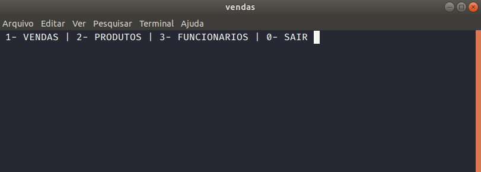
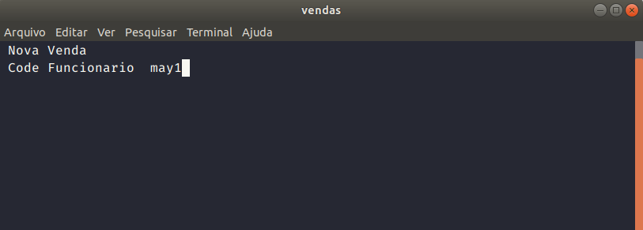

# ciencias da computação 4º periodo
## linguagem de programação C

### Um dos mais intereçante foi um sistema de vendas com leitura e escrita em arquivo txt

`
  project/vendas
`

### contendo as funçoes de 
  

  1. vendas 
    - logar com funcionario previamente cadastrado 
    - adicionar produtos ao carrinho inserindo codigo dos produtos ja cadastrado 
    - imprimir em tela o carrinho conforme for adicionando no carrinho  
  
  

  2. produtos 
    - Cadastrar novo produto caso o mesmo ainda nao esteja cadastrado 
    - Buscar produto caso o mesmo ja esteja cadastrado 
    - Editar produto caso o mesmo ja esteja cadastrado 
    - Excluir produto caso o mesmo ja esteja cadastrado 
    - Listar produtos cadastrado  
  

  3. funcionario 
    - Cadastrar novo funcionario caso o mesmo ainda nao esteja cadastrado 
    - Buscar funcionario caso o mesmo ja esteja cadastrado 
    - Editar funcionario caso o mesmo ja esteja cadastrado 
    - Excluir funcionario caso o mesmo ja esteja cadastrado 
    - Listar funcionarios cadastrado  
  